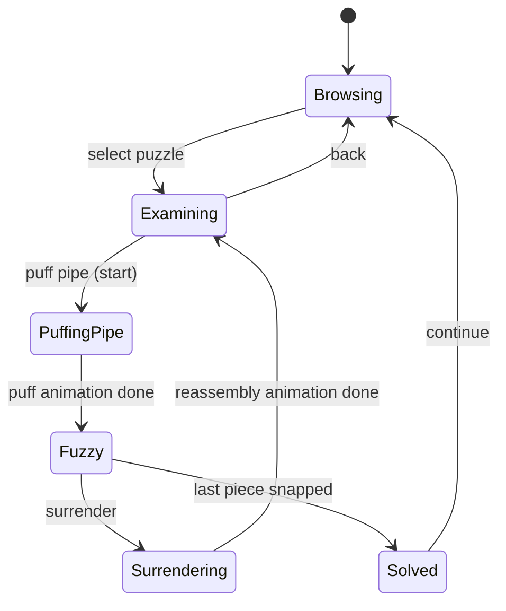

# Launching Godot IDE

Execute Godot_v4.6.3-stable_win64.exe from
WuzzyFuzzlePizard/tools/godot

# Game Debug mode

## The F5 run-window toolbar

When the project is run from the editor (F5, or the play button), a floating strip of controls appears at the top of the running window. These are **debug tools only** — they're part of Godot's editor-side "Game" workspace and have no effect on exported/shipped builds.

Buttons, roughly left to right:

- **Pause / Resume** — freeze the running scene.
- **Next Frame** — advance exactly one frame while paused.
- **Make Window Floating** — pop the game out into its own OS window (useful when the toolbar is in the way).
- **Select node / Manipulate** — click inside the running game to pick the live node in the Remote scene tree; great for inspecting state at runtime.
- **Influence camera / Override camera** — let the editor's 2D/3D camera take over from the in-game camera while debugging.
- **Suspend / Mute audio**.

To hide or relocate the toolbar: **Editor → Editor Settings → Run → Window Placement**, or just click **Make Window Floating** to pop the game into a separate OS window with no overlay.

# Gameplay workflow

## High-level state machine

The player is always in exactly one mode. Modes are owned by the `GameState` autoload (`scripts/game_state.gd`) and transitions are driven by signals.

Notes:

- `PuffingPipe` and `Surrendering` are short, non-interactive transition states that own animations. They exist so the rest of the game never has to ask "is the puff animation playing?" — it just asks the mode.
- The "higher gradations of fuzzy mode as multiplier" idea is represented by `GameState.fuzz_level` (0.0–1.0), separate from the mode enum. While `mode == Fuzzy`, `fuzz_level` can vary (deeper puff = higher level = bigger multiplier).
- `Examining` allows inspection only. Manipulation is gated to `Fuzzy` (matches design option 2 in `first_notes.md`).

## Input actions (to register in Project Settings → Input Map)

| Action name        | Default binding         | Used in mode(s)         |
|--------------------|-------------------------|-------------------------|
| `puzzle_puff`      | Space                   | Examining → PuffingPipe |
| `puzzle_surrender` | Esc                     | Fuzzy → Surrendering    |
| `piece_grab`       | Left Mouse Button       | Fuzzy                   |
| `piece_rotate`     | R / Right Mouse Button  | Fuzzy                   |
| `puzzle_zoom`      | Mouse Wheel             | Examining, Fuzzy        |
| `puzzle_back`      | Esc                     | Examining → Browsing    |

Bind by name in code (`Input.is_action_just_pressed("puzzle_puff")`) so rebinding never touches game logic.

## Starter code layout

Files created under `game/`:

- `scripts/game_state.gd` — autoload singleton. Owns the mode enum, `fuzz_level`, `score`, and the multiplier. Emits `mode_changed`, `fuzz_level_changed`, `score_changed`. Mode transitions go through small intent methods (`request_puff`, `puff_animation_finished`, `request_surrender`, `surrender_animation_finished`, `mark_solved`) so animations and UI don't poke the enum directly.
- `scripts/puzzle.gd` — `class_name Puzzle extends Resource`. Plain data: name, source image, grid size, base score. Easy to make `.tres` instances per puzzle later.
- `scripts/puzzle_piece.gd` — `class_name PuzzlePiece extends Node2D`. Draggable in `Fuzzy` mode only. Snaps to `target_position` within `snap_radius`. Updates its shader uniform whenever `GameState.fuzz_level` changes.
- `shaders/fuzz.gdshader` — placeholder fuzz effect: `mix(color, gray, fuzz_amount)`. Real blur/distortion later; the uniform name is the contract.
- `scenes/puzzle_piece.tscn` — minimal scene: `Node2D` (PuzzlePiece script) → `ColorRect` (96×96, beige, fuzz shader material). Swap the `ColorRect` for a `Sprite2D` once real art exists.

### Wiring up the autoload

After opening the project in Godot:

1. **Project → Project Settings → Globals tab → Autoload**.
2. Path: `res://scripts/game_state.gd`, Node Name: `GameState`, **Enable** checked, click **Add** (don't forget this — typing the path alone doesn't register it).

That's what makes `GameState.mode`, `GameState.fuzz_level`, etc. globally available from any script.

### Quick sanity check

1. Open `scenes/puzzle_piece.tscn`. The beige square should render.
2. Add a temporary script to `main.tscn` that on `_ready()` calls `GameState.mode = GameState.Mode.FUZZY` and tweens `GameState.fuzz_level` from 0 to 1 over 2 seconds.
3. Instance a few `puzzle_piece.tscn` children in `main.tscn`. Set each piece's `target_position` in the inspector.
4. Run. The squares should fade toward gray as `fuzz_level` rises, and become draggable. Drag one near its target — it snaps and the score (visible via `GameState.score`) goes up, scaled by the multiplier.
